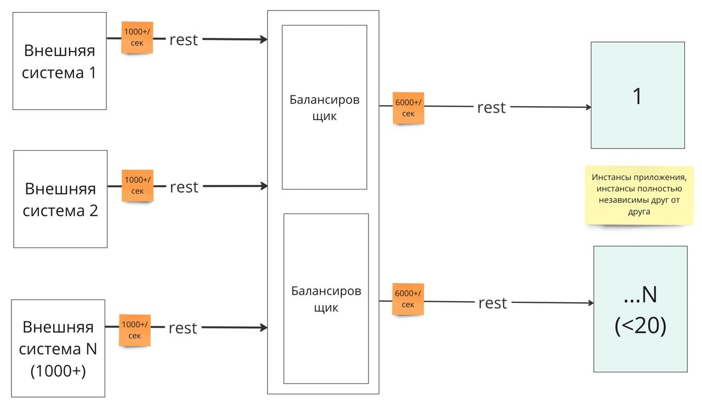

# Выбор HTTP-балансировщика нагрузки

## Описание

Есть существующее решение. В нем внешние системы общаются с инстансами приложения напрямую (p2p). Инстансы приложения иногда падают. Требуется выбрать балансировщик нагрузки и поставить его между внешними системами и внутреними приложенниями (см изображение).

Вопросы:
1. На что обратить внимание при выборе балансировщика?
2. Какой балансировщик посоветуете под такую архитектуру и почему?
3. Какой точно не посоветуете под такую архитектуру и почему?

Внешние системы – они совсем внешние, это внешние партнеры, например.

## Уточнения

В ходе обсуждения был сформулирован перечень дополнительных вопросов, играющих существенную роль в выборе балансировщика нагрзуки:

|Вопрос                          |Ответ автора кейса          |
|--------------------------------|-----------------------------|
|Какая нагрузка ожидается? 100rps, 1000rps, 100000rps             |6000+ rps           |
|Сколько длится обработка запроса (10ms, 100ms, 1000ms, 10000ms)|10ms, ответ давать не требуется |
|Кто (внешние системы или балансировщик) отвечают за повтор запросов при сбоях?|Внешние системы|
|Где все развернуто (публичное облако, свое облако, не облако)?|не облако|
|Нужна ли балансировка между ДЦ или все внутри ДЦ?|это два разных решения, нужны оба, но можно рассмотреть по отдельности, так как живут они отдельно|
|Есть ли какие-то дополнительные правила на балансировке (sticky sessions, разметка для канарейки и т.п.)?|нет, только дополнение запроса айпишником отправителя|
|Нужна ли доп.функциональность на балансировщике - авторизация, аутентификация, терминирование tls, биллинг, бюджетирование и так далее?|нет, аутентификация идет по login/pass, для пары login/pass сверяется ip-адрес|
|Какие алгоритмы балансировки нужны - round-robin, взвешенная, на основе скорости отклика?|пока не ясно, надо экспериментировать, сейчас цель - поставить между партнерами и внутренними системами прослойку с возможностью балансировки максимально без усилий (без самописов и изменения существующих систем)|
|Какие решения уже эксплуатируются в компании?| Никакие |
|По каким решениям в команде есть эспертиза?| Nginx |

## Предложенные решения

Значительно усложняет выбор сочетание необходимости повторов запросов балансировщиком и потребность в балансировке между различными датацентрами. Nginx из коробки так не умеет, однако в описанном кейсе за повторы отвечают сами внешние системы.

### Решение 1

С указанными требованиями справится любой балансировщик. 
Nginx, – удовлетворяет всем требованиям.

**Проблемы**
Сложность в HA между датацентрами и  внутри датацентра.
Из коробки Nginx не умеет балансировку между датацентрами, как решение можно использовать стандартный линуксовый механизм для HA (High Availability)

**Ссылки**

[Nginx HA](https://www.nginx.com/products/nginx/high-availability/)

### Решение 2
Делегировать выбор тем инженерам, кто будет отвечать за эксплуатацию и достижение/поддержание заданных показателей. 

### Обсуждение

https://t.me/archicases/1564/1565

