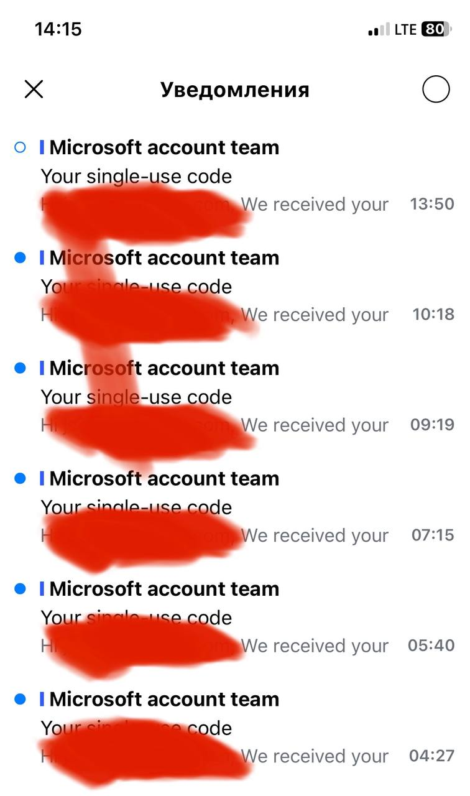

# Реализация одноразовых паролей

## Контекст проблемы

Меня активно пытаются поломать прямо сейчас. И я подумал, а как можно решить такую проблему? Ведь явно архитектурная задача.

Описание:

- есть сервис и подтверждение операций по одноразовому коду
- кто-то раз в какое-то время, вот как здесь раз в час что-то пытается сделать и мне прилетает одноразовы пароль
- когда мне потребуется что-то подтвердить самому, я могу случайно использовать одноразовый пароль злоумышленника, если так совпадет, что он запросит права в то же самое время

Как блокировать - непонятно, айпишник может быть динамическим.

Можно указывать в письме на какое действие этот одноразовый код, но это сильно усложняет решение.

Какие вообще есть опции?

## Предложенные решения

### TOTP

Перенести создание одноразовых паролей на сторону клиента, сервер лишь ожидает подтверждение операции путём ввода кода клиентом.

Один из возможных вариантов реализации это [Time-based One Time Password(TOTP)](https://en.wikipedia.org/wiki/Time-based_one-time_password). Приложения Google authenticator, Microsoft authenticator.

TOTP независим от канала связи с интернет.
Из независимости от связи TOTP следует и его же главный недостаток - нет привязки кода к подтверждаемой сессии, то есть код TOTP подходит для подтверждения любой операции в текущий момент.

TOTP может быть сложен в применении для рядовых пользователей.

### OCRA

Алгоритм [RFC-6237 OCRA](https://datatracker.ietf.org/doc/html/rfc6287), основан на TOTP, но требует наличие challenge от сервера. Так можно привязать код аутентификации к конкретной сессии сервера.

Недостаток OCRA в том что он требует быть онлайн.

### Аппаратное устройство аутентификации

Например токен [YubiKey](https://www.yubico.com/products/), смарт-карты, и аппратные устройства, в том числе биометрические датчики.

Подтвердить операцию невозможно без обладания физическим устройством.
Сессия аутентфиикации может быть связана с конкретной подтверждаемой операцией  — зависит от реализации прикладной системы.

Как правило аппаратное устройства защищено PIN-кодом или биометрическим датчиком, то есть для аутентификации требуется физическое устройство и пароль или биометрический отпечаток к нему.

Это лучший с точки зрения безопасности вариант,
однако применение аппаратного устройства возможно не во всех пользовательских сценариях, а так же требуется реализация поддержки протоколов Web Authentication API или FIDO2 в прикладной системе.

## Заключение

При любом выбранном варианте реализации важно:

* Одноразовый код должен быть привязан к конкретной операции
* Если код генерируется сервером, то в сообщении клиенту должны присутствовать идентификатор и краткое описание подтверждаемой операции, например "Вход в учетную запись", "Платеж 100руб Паркинг №123"
* Проверка одноразового кода всегда производится в рамках действующей сессии основной авторизации, то проверяется так же наличие основной действующей авторизации (логина-пароля).
* В сообщениях клиенту нежелательно использовать код в виде гиперссылок, клиент может нажать не глядя

## Источник

[11: одноразовые пароли](https://t.me/archicases/1644)

## Тестируем гиперссылки

* [Реализация одноразовых паролей](/2023/05/20230506160801-one-time-passwords.md)
